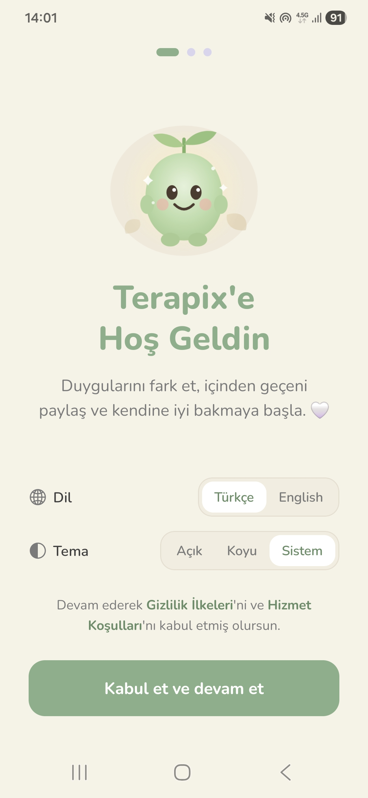
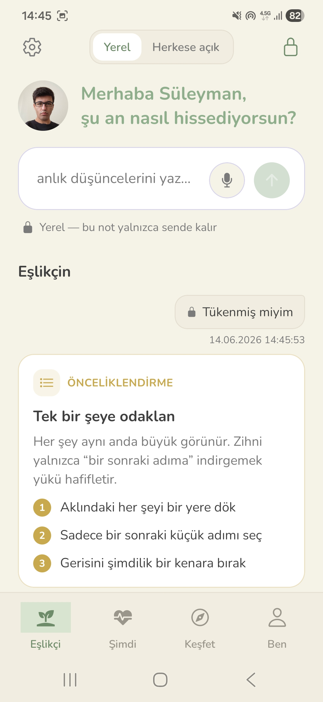
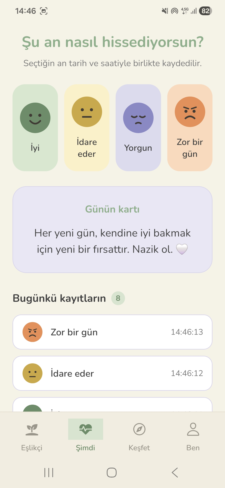
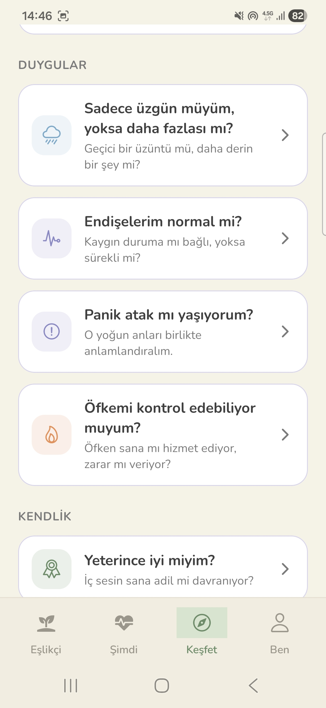
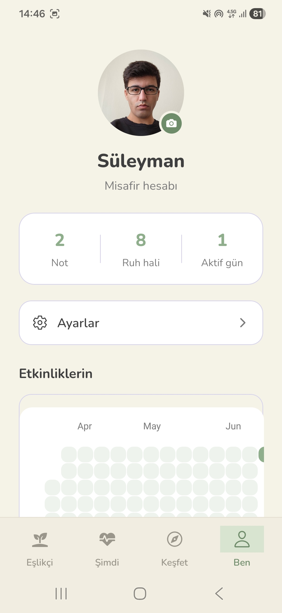
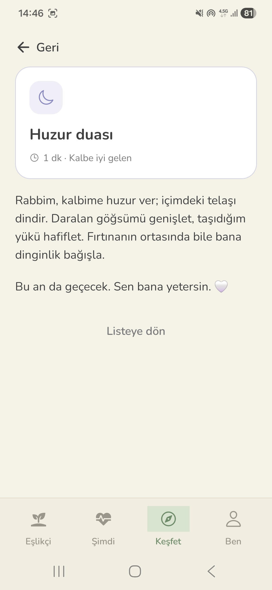

<div align="center">

# 🌿 Terapix

**Duygularını fark et, içinden geçeni paylaş, kendine iyi bak.**

Ruh hâli takibi, sesli/yazılı günlük, kanıta dayalı mini-egzersizler ve öz-değerlendirme testlerini tek bir sakin alanda toplayan; **çevrimdışı çalışan** ve **gizliliğe saygılı** bir mental iyi oluş yol arkadaşı.


</div>

---

## 📌 Çözdüğü Problem

Ruhsal desteğe erişim her zaman kolay, hızlı veya uygun fiyatlı değildir. Birçok insan zor bir anda ne hissettiğini adlandırmakta bile zorlanır.

**Terapix terapinin yerini almaz** — ama desteğe ulaşana kadar elinin altında, yargısız ve özel bir alan sunar:

- Anı yakalayıp duyguyu adlandırma (ruh hâli + günlük)
- Yazdığın şeye uygun, **kanıta dayalı bir baş etme egzersizi** alma
- Kendini güvenli sorularla keşfetme
- Kriz ifadelerinde **önceliklendirilmiş, güvenlik-odaklı** yönlendirme

> 💡 **İnovasyon:** Notunu sınıflandıran eşleştirme motoru tamamen **cihaz üzerinde ve çevrimdışı** çalışır — veri buluta gönderilmeden, gizlilik korunarak. Kriz ifadeleri her zaman önceliklidir.

---

## ✨ Özellikler

### 🗣️ Eşlikçi — akıllı günlük
- Yazılı **veya sesli** not bırak.
- Cihaz üzerinde çalışan anahtar-kelime eşleştirme motoru, notunu **10 duygu kategorisine** (kaygı, üzüntü, öfke, stres, yalnızlık, öz-eleştiri, uyku, ilişki, olumlu ve **kriz**) ayırır ve sana uygun bir terapi/CBT kartıyla yanıt verir.
- **Yerel** veya **herkese açık** görünürlük seçeneği.

### 😊 Şimdi — ruh hâli takibi
- Tek dokunuşla 4 ruh hâli (İyi / İdare eder / Yorgun / Zor bir gün), tarih-saatiyle kaydedilir.
- Günün kartı ve günlük kayıt sayacı.

### 🧭 Keşfet
- **Öz-değerlendirme testleri** — sorulara göre tonlanmış (sakin / düşündüren / uyarı) sonuç, ipuçları ve önerilen egzersiz.
- **Kanıta dayalı okumalar** — kaynaklı, okuma süresi etiketli kartlar.
- **Sahnelerle yansıtma** — görsel + his seçimiyle nazik geri bildirim.

### 👤 Ben — profil & istatistik
- Profil fotoğrafı (galeriden seçilebilir).
- Not / ruh hâli / aktif gün istatistikleri.
- **90 günlük aktivite ısı haritası** (GitHub tarzı katkı grafiği).
- Geçmiş değerlendirmeler ve ruh hâli dağılımı.

### 🎨 Deneyim
- Açık / Koyu / Sistem teması, Nunito tipografi, tutarlı tasarım sistemi.
- Mikro-etkileşimler: dokunsal geri bildirim (haptics), Reanimated giriş animasyonları, animasyonlu maskot.
- 3 adımlı onboarding (dil TR/EN + tema + e-posta veya misafir giriş).
- Oyunlaştırma: aktif gün serileri, katkı grafiği, günlük sayaç rozetleri.

---

## 📸 Ekran Görüntüleri

<div align="center">

| Hoş Geldin | Eşlikçi — akıllı günlük | Şimdi — ruh hâli |
|:---:|:---:|:---:|
|  |  |  |

| Keşfet — öz-değerlendirme | Ben — profil & istatistik | İçerik & okumalar |
|:---:|:---:|:---:|
|  |  |  |

</div>

---

## 🏗️ Mimari

Terapix **katmanlı / MVVM benzeri** bir yapı kullanır; arayüz, durum (state) ve iş mantığı net biçimde ayrılır:

- **Görünüm (View):** `app/` (Expo Router ekranları) + `components/` (temadan haberdar, salt sunum bileşenleri).
- **Durum / ViewModel:** `contexts/` — `JournalProvider`, `ProfileProvider`, `SettingsProvider`; durumu ve iş aksiyonlarını `useJournal`, `useProfile`, `useSettings` hook'larıyla sunar.
- **Alan / Veri (Domain):** `lib/` — saf, test edilebilir, çevrimdışı iş mantığı (terapi eşleştirme, test değerlendirme, okumalar, sahneler, biçimlendirme, Firebase senkron).

**Yerel-öncelikli (local-first) veri:** Tüm kayıtlar `AsyncStorage`'da tutulur (tek doğruluk kaynağı). Firebase **opsiyoneldir** — `.env` anahtarları varsa kayıtlar Firestore'a sessizce senkronlanır; yoksa firebase paketi hiç yüklenmez ve uygulama tamamen çevrimdışı, hatasız çalışır (_graceful degradation_).

**Tip güvenliği & modernlik:** Baştan sona TypeScript, ayrık birleşim (discriminated union) tipli günlük kayıtları, Expo "typed routes" ve React Compiler etkin.

```
Terapix/
├── app/                  # Expo Router ekranları (dosya tabanlı yönlendirme)
│   ├── (auth)/           # Onboarding / giriş akışı
│   ├── (tabs)/           # Sekmeler: index (Eşlikçi), simdi, kesfet, ben
│   └── _layout.tsx       # Kök yerleşim + Provider'lar
├── components/           # Yeniden kullanılabilir, temalı UI bileşenleri
├── contexts/             # Durum yönetimi (journal, profile, settings)
├── hooks/                # use-theme, use-color-scheme ...
├── lib/                  # Alan/iş mantığı (çevrimdışı, saf)
│   ├── therapy/          # Terapi kartları + eşleştirme motoru
│   ├── guides/           # Öz-değerlendirme testleri
│   ├── readings/         # Kanıta dayalı okumalar
│   ├── scenes/           # Görselle yansıtma sahneleri
│   └── firebase.ts       # Opsiyonel Firestore senkron
├── constants/            # palette.ts (tema token'ları), theme.ts
├── assets/               # İkonlar, görseller, fontlar
└── app.json              # Expo yapılandırması
```

---

## 🛠️ Teknoloji Yığını

- **Çatı:** Expo SDK 54, React Native 0.81, React 19
- **Yönlendirme:** Expo Router 6 (dosya tabanlı)
- **Dil:** TypeScript
- **Bulut (opsiyonel):** Firebase / Firestore
- **Yerel kalıcılık:** AsyncStorage
- **Animasyon & jest:** react-native-reanimated, react-native-gesture-handler
- **Grafik:** react-native-chart-kit
- **Cihaz API'leri:** expo-av (ses), expo-haptics, expo-image-picker, expo-notifications
- **Tipografi & görsel:** @expo-google-fonts/nunito, react-native-svg

---

## 🚀 Kurulum

**Gereksinimler:** Node.js 20+, [Expo Go](https://expo.dev/go) uygulaması (telefonda denemek için).

```bash
# Depoyu klonla
git clone https://github.com/karahanlis420-ui/Terapix.git
cd Terapix

# Bağımlılıkları kur
npm install

# Geliştirme sunucusunu başlat
npx expo start
```

Çıkan QR kodu telefonunda **Expo Go** ile okut; ya da terminalde `a` (Android), `i` (iOS), `w` (web) tuşlarına bas.

---

## 🔑 Ortam Değişkenleri (opsiyonel)

Bulut senkronu istiyorsan `.env.example` dosyasını `.env` olarak kopyala ve Firebase değerlerini doldur. **Boş bırakırsan uygulama yerel modda sorunsuz çalışır.**

```env
EXPO_PUBLIC_FIREBASE_API_KEY=
EXPO_PUBLIC_FIREBASE_AUTH_DOMAIN=
EXPO_PUBLIC_FIREBASE_PROJECT_ID=
EXPO_PUBLIC_FIREBASE_STORAGE_BUCKET=
EXPO_PUBLIC_FIREBASE_MESSAGING_SENDER_ID=
EXPO_PUBLIC_FIREBASE_APP_ID=
```

---

## 🗺️ Yol Haritası

- [ ] Topluluk akışı (herkese açık paylaşımlar)
- [ ] Hatırlatıcı bildirimleri (expo-notifications)
- [ ] Çoklu dil desteğinin tamamlanması (TR/EN)
- [ ] Ses kayıtlarının oynatılması ve bulut yedeği

---

## ⚠️ Sorumluluk Reddi

Terapix tıbbi bir cihaz veya profesyonel terapi/teşhis aracı **değildir** ve profesyonel yardımın yerini tutmaz. Zor bir dönemden geçiyorsan bir uzmana başvur. **Acil bir durumda 112'yi ara.**

---

## 👨‍💻 Geliştirici

**[Adını & bölümünü buraya yaz]**
Bu proje bir mobil uygulama geliştirme dersi kapsamında hazırlanmıştır.
